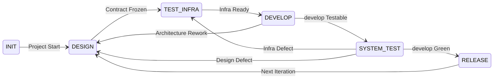

<div align="center">

# devloop

A contract-driven project development system — Agents follow a 6-phase state machine to autonomously drive projects through multiple iterations, not one-shot.

[](https://opensource.org/licenses/MIT)
[](https://agentskills.io/specification)

</div>



## Features

- **6-Phase State Machine**: INIT → DESIGN → TEST_INFRA → DEVELOP → SYSTEM_TEST → RELEASE → Next Iteration
- **Contract-Driven**: Spec / AC / ADR / Interface definitions are frozen before coding; each document is reviewed immediately after writing before proceeding downstream
- **Gitflow Branch Model**: `main` contains only release nodes, `develop` for continuous integration, branch types aligned with commit types
- **SemVer Versioning**: `X.Y.Z`, during MAJOR=0, MINOR = features, PATCH = fixes, starting from `0.1.0`
- **Two-Tier Gates**: Automated (CI / tests / coverage) + Agent judgment (document semantics / self-verification / failure classification)
- **Self-Describing Entry**: Agents recover state from the filesystem alone after interruption, with no dependency on conversation history
- **Full Traceability**: Plan → Report → Commit semantic chain

## Skills

| Skill | Description |
|-------|-------------|
| [`devloop`](skills/devloop) | Contract-driven project development system. Use when an Agent needs to initialize a project, understand what can be done in the current phase, advance state, or create and manage documents. |

## Documentation

- [Design Spec](docs/design.md) — System boundaries, state machine definition, document architecture, testing system
- [SKILL.md](skills/devloop/SKILL.md) — Execution layer entry: state machine routing, system rules, per-phase operation paths

## Quick Start

Paste this into your AI agent (Claude Code, Cursor, OpenAI Assistants, etc.):

```text
Install the Agent Skills from https://raw.githubusercontent.com/vlln/devloop/main/README.md
```

## Installation

Recommended: install these skills with `skit`. It fetches skills from the published repository, records them in a local manifest, and activates them for local agents.

### skit

Install `skit` with Homebrew:

```sh
brew install vlln/tap/skit
```

For other platforms, see the `skit` installation instructions.

Install one skill:

```sh
skit install vlln/devloop/skills/devloop
```

Install all skills in this repository:

```sh
skit install vlln/devloop --all
```

### npx skills

```sh
npx skills add vlln/devloop
```

### Manual

Copy the desired skill directory from `skills/<skill-name>` into your agent's skills directory, then restart the agent if required.

Common locations:

- Codex CLI: `~/.codex/skills`
- Claude Code: `.claude/skills` in the project, or the configured user skills directory
- OpenCode: `~/.opencode/skills/<repo-name>`

## Requirements

- `skit` CLI for install and validation workflows.

## License

MIT