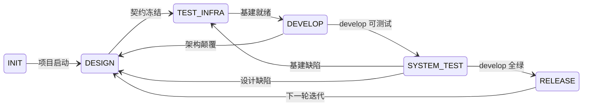

# devloop

契约驱动的项目开发系统 — Agent 加载后按 6 阶段状态机自主推进项目，非一次性，多轮迭代。



## 特性

- **6 阶段状态机**：INIT → DESIGN → TEST_INFRA → DEVELOP → SYSTEM_TEST → RELEASE → 下一轮迭代
- **契约驱动**：Spec / AC / ADR / 接口定义在编码前冻结，每个文档写完即审，审过才进下游
- **Gitflow 分支模型**：`main` 仅含 release 节点，`develop` 持续集成，分支类型与 commit type 一致
- **SemVer 版本策略**：`X.Y.Z`，MAJOR=0 期间 MINOR 升功能、PATCH 修 bug，首次从 `0.1.0` 起步
- **双层门禁**：自动化（CI / 测试 / 覆盖率）+ Agent 判断（文档语义 / 自证 / 失败分类）
- **自描述入口**：Agent 中断后仅凭文件系统恢复状态，不依赖对话历史
- **全链路可追溯**：Plan → Report → Commit 语义链

## Skills

| Skill | 描述 |
|-------|------|
| [`devloop`](skills/devloop) | 契约驱动的项目开发系统。当 Agent 需要初始化项目、理解当前阶段能做什么、推进状态、创建和管理文档时使用。 |

## 文档

- [元设计文档](docs/design.md) — 系统边界、状态机定义、文档体系、测试体系
- [SKILL.md](skills/devloop/SKILL.md) — 执行层入口：状态机路由、系统规则、按阶段操作路径

## 快速开始

将以下内容粘贴到 AI Agent（Claude Code、Cursor、OpenAI Assistants 等）中：

```text
Install the Agent Skills from https://raw.githubusercontent.com/vlln/devloop/main/README.md
```

## 安装

推荐使用 `skit` 安装。它从发布仓库获取 skills，记录到本地清单，并为本地 Agent 激活。

### skit

通过 Homebrew 安装 `skit`：

```sh
brew install vlln/tap/skit
```

其他平台见 `skit` 安装文档。

安装单个 skill：

```sh
skit install vlln/devloop/skills/devloop
```

安装本仓库所有 skills：

```sh
skit install vlln/devloop --all
```

### npx skills

```sh
npx skills add vlln/devloop
```

### 手动安装

将 `skills/<skill-name>` 目录复制到 Agent 的 skills 目录，重启 Agent 即可。

常见路径：

- Codex CLI: `~/.codex/skills`
- Claude Code: 项目中的 `.claude/skills`，或已配置的用户 skills 目录
- OpenCode: `~/.opencode/skills/<repo-name>`

## 依赖

- `skit` CLI，用于安装和校验 workflow。

## 许可证

MIT