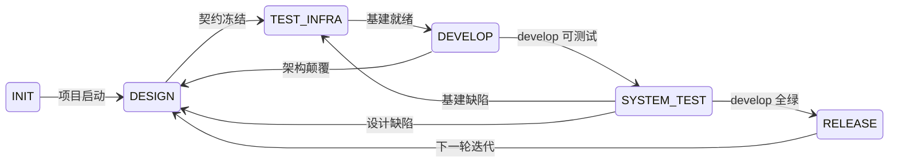

# devloop

契约驱动的项目开发系统 — Agent 加载后按 6 阶段状态机自主推进项目，非一次性，多轮迭代。



## 特性

- **6 阶段状态机**：INIT → DESIGN → TEST_INFRA → DEVELOP → SYSTEM_TEST → RELEASE → 下一轮迭代
- **契约驱动**：Spec / AC / ADR / 接口定义在编码前冻结，每个文档写完即审，审过才进下游
- **Gitflow 分支模型**：`main` 仅含 release 节点，`develop` 持续集成，分支类型与 commit type 一致
- **SemVer 版本策略**：`X.Y.Z`，MAJOR=0 期间 MINOR 升功能、PATCH 修 bug，首次从 `0.1.0` 起步
- **双层门禁**：自动化（CI / 测试 / 覆盖率）+ Agent 判断（文档语义 / 自证 / 失败分类）
- **自描述入口**：Agent 中断后仅凭文件系统恢复状态，不依赖对话历史
- **全链路可追溯**：Plan → Report → Commit 语义链

## Skills

| Skill | Description |
|-------|-------------|
| [`devloop`](skills/devloop) | 契约驱动的项目开发系统。当 Agent 需要初始化项目、理解当前阶段能做什么、推进状态、创建和管理文档时使用。 |

## 文档

- [元设计文档](docs/design.md) — 系统边界、状态机定义、文档体系、测试体系
- [SKILL.md](skills/devloop/SKILL.md) — 执行层入口：状态机路由、系统规则、按阶段操作路径

## Quick Start

Paste this into your AI agent (Claude Code, Cursor, OpenAI Assistants, etc.):

```text
Install the Agent Skills from https://raw.githubusercontent.com/vlln/devloop/main/README.md
```

## Installation

Recommended: install these skills with `skit`. It fetches skills from the published repository, records them in a local manifest, and activates them for local agents.

### skit

Install `skit` with Homebrew:

```sh
brew install vlln/tap/skit
```

For other platforms, see the `skit` installation instructions.

Install one skill:

```sh
skit install vlln/devloop/skills/devloop
```

Install all skills in this repository:

```sh
skit install vlln/devloop --all
```

### npx skills

```sh
npx skills add vlln/devloop
```

### Manual

Copy the desired skill directory from `skills/<skill-name>` into your agent's skills directory, then restart the agent if required.

Common locations:

- Codex CLI: `~/.codex/skills`
- Claude Code: `.claude/skills` in the project, or the configured user skills directory
- OpenCode: `~/.opencode/skills/<repo-name>`

## Requirements

- `skit` CLI for install and validation workflows.

## License

MIT