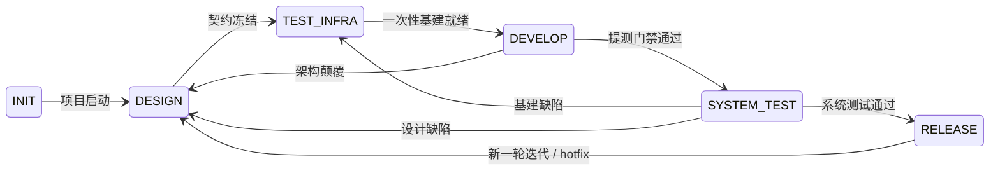

# Project Pact

## 系统全貌

项目开发遵循 6 阶段状态机。每个阶段有明确的**证明命题**和**出口把关**——Agent 通过出口把关证明该阶段的命题成立，方可推进。



内层流程（子阶段、并行策略、TDD 闭环）见各阶段独立文档，SKILL.md 仅定义外层跳转。

### 阶段证明链

| 阶段 | 证明命题 | 出口把关（Agent 必须验证） |
|------|---------|--------------------------|
| **INIT** | 项目骨架就绪，可进入设计 | 目录结构存在、AGENTS.md/CONTRIBUTING.md/CHANGELOG.md 存在、Git 已初始化 |
| **DESIGN** | 契约已冻结，可进入一次性基建搭建 | vision.md/Spec/AC 文档/接口定义 status=proposed（内容级检查）、核心 ADR 全部 status=proposed（技术选型/存储/架构模式，验证段不为空）。审查通过后 promote proposed→active/accepted |
| **TEST_INFRA** | 一次性基建就绪，可进入业务开发 | 测试基建 ADR 全部 proposed、CI 流水线可运行、MR 门禁正确拦截、提测门禁正确拦截、Mock 返回正确、覆盖率数据准确、E2E 框架可跑冒烟、E2E 脚本对齐 AC、全部 Plan 文件夹已创建 |
| **DEVELOP** | 各模块独立功能正确，可进入系统测试 | 全部 Plan 完成、MR 门禁全部通过（TEST_INFRA 已配置）、打包部署成功、提测门禁通过（TEST_INFRA 已配置） |
| **SYSTEM_TEST** | 系统级验证通过，可进入预发布 | 全部测试层通过（集成→系统→专项），无阻塞级缺陷。基建缺陷退回 TEST_INFRA，设计缺陷退回 DESIGN |
| **RELEASE** | 本轮迭代已闭环，可开始新迭代 | CD 部署到 production 成功、生产冒烟测试通过、版本 tag 已打、CHANGELOG 已整理、归档完成。staging 验证作为 RELEASE 内部步骤

**出口把关是不可跳过的硬性检查。** Agent 在每个阶段结束时必须逐项验证出口把关，全部通过方可推进。如果出口把关不通过，留在当前阶段修复，不得推进。

**DEVELOP 流程：** 编码（TDD 左移）→ MR 门禁（TEST_INFRA 已配置）→ 打包部署 → 提测门禁（TEST_INFRA 已配置）。

**Agent 无状态。** 任何 Agent 可以随时被终止，下次启动时仅凭文件系统恢复状态。所有关键信息在文档中，不在对话历史中。

---

## 迭代模式

同一状态机骨架，三种迭代模式。Agent 进入 DESIGN 时根据已有文档状态自动判断：

### 首次设计（INIT → DESIGN）

所有文档全新创建。走完所有子阶段，不加跳过。

### 增量迭代（RELEASE → DESIGN）

已有文档已冻结。进入 DESIGN 后：
- vision.md 已 active → 跳过，不重写
- Spec 已 active → 在现有文档上追加，不重写
- AC 文档已 active → 在现有文档上追加场景，不重写
- 已有 ADR 已 accepted → 不修改，仅新增 ADR
- 已有 Plan 已 done → 新建 Plan，不重建

### 设计变更（DEVELOP → DESIGN，架构颠覆退回）

从 DEVELOP 因架构颠覆退回。进入 DESIGN 后走「设计变更」子阶段：
1. 定级：确认为架构颠覆（非轻微约束）
2. ADR 修订：旧 ADR 追加修订记录，或标记 superseded + 新建 ADR
3. 传导下游：同步更新受影响的 Spec、AC 文档、通知受影响 Plan、更新 Plan
4. 恢复编码：以新 ADR 为依据重新推进到 DEVELOP

**注意：** 轻微约束（依赖能用但方式与预期不一致）在 DEVELOP 内解决，不退回 DESIGN。

### 基建修复（SYSTEM_TEST → TEST_INFRA，基建缺陷退回）

从 SYSTEM_TEST 因基建缺陷退回。进入 TEST_INFRA 后走增量修复：
1. 定级：确认为基建缺陷（门禁未拦截、覆盖率错乱、Mock 不对、E2E 框架不稳定），非业务 bug 或设计缺陷
2. 定位：定位到具体基建组件，修复对应的 Plan 或配置
3. 自证：修复后重新走 TEST_INFRA 出口把关（特别是"正确拦截"项）
4. 恢复流程：TEST_INFRA 出口把关通过后重新推进到 DEVELOP，已完成的业务 Plan 不受影响

### 设计缺陷（SYSTEM_TEST → DESIGN）

---

### 热修复（RELEASE → DESIGN，生产阻断性故障）

生产阻断性故障走热修复快速通道，不完整走全量 DESIGN：

1. 定级：确认为阻断性故障（线上不可用/核心功能损坏），非轻微缺陷
2. 轻量 DESIGN：跳过 full Spec/AC，仅修订受影响 ADR（如有设计变更）
3. TEST_INFRA：增量修复，已完成基建不受影响
4. DEVELOP：创建最小修复 Plan，走 TDD → MR 门禁
5. SYSTEM_TEST：全量回归测试
6. RELEASE：打补丁 tag（如 v1.2.1），归档

**注意：** 非阻断性缺陷走正常增量迭代（RELEASE → DESIGN），不走热修复。

---

## 执行单元

`docs/plans/` 下的每个文件夹是一个执行单元。任何需要执行的任务（搭建基建、业务开发、部署）都通过创建 Plan 文件夹来组织。

- 文件夹内包含 Plan 文件（描述执行计划）和 Report 文件（执行结果留档）
- 每个 Plan 在独立 Git branch 中执行，完成后合并
- 各阶段创建自己的 Plan 文件夹，不替下游阶段创建

---

## 安装系统

INIT 阶段将项目接入 devloop 系统。分新项目（安装）和旧项目（接入）两种场景，详见 [references/phase-init.md](references/phase-init.md)。

---

## 导航系统

系统文档是自描述的。按以下顺序读取：

```
1. AGENTS.md           → 项目入口地图：文档类型、目录结构、系统边界、阶段行为
2. docs/README.md      → 当前系统状态 + 行为边界（首先读取！）
3. CONTRIBUTING.md     → 编码/测试/PR 规范（项目自定义）
4. 各级 README.md      → 子目录索引和状态
5. 具体文档             → Vision / AC / Spec / ADR / Plan / Report
```

---

## 系统规则

### 文档命名

| 文档 | 格式 | 示例 |
|------|------|------|
| Vision | `vision.md` | `vision.md` |
| Spec | `00x-xxxx.md` | `001-vagent.md` |
| Interface | `00x-xxxx.md` | `001-order-api.md` |
| AC | `00x-xxxx.md` | `001-order-ac.md` |
| ADR | `000x-xxxx.md` | `0001-db-choice.md` |
| Plan 文件夹 | `000x-简短描述` | `0001-订单模块` |
| Plan 子任务 | `0x-plan-xxx.md` | `01-plan-order-api.md` |
| Report | `0x-report-xxx.md` | `01-report-order-api.md` |

### Frontmatter

以下文档类型使用 YAML frontmatter（`---` 包裹），位于文件最顶部：

| 文档类型 | 必填字段 |
|----------|----------|
| Vision | `title`, `description`, `type: vision`, `status`, `created` |
| Document | `title`, `description`, `type: spec`, `status`, `version`, `created` |
| Interface | `title`, `description`, `type: interface`, `status`, `version`, `created` |
| AC | `title`, `description`, `type: ac`, `status`, `version`, `created` |
| ADR | `title`, `description`, `type: adr`, `status`, `created` |
| Plan | `title`, `description`, `type: plan`, `status`, `created` |
| Report | `title`, `description`, `type: report`, `status`, `created` |

`created` 使用 ISO 8601 格式 (`YYYY-MM-DDTHH:MM:SSZ`)。`version` 仅 Spec 使用，整数递增。

以下文件**不使用** frontmatter：
- AGENTS.md、CONTRIBUTING.md、CHANGELOG.md
- 所有 README.md

### status 有效值

| 文档类型 | 状态值 | 流转 |
|----------|--------|------|
| Vision | `draft` / `proposed` / `active` / `archived` | draft→proposed→active→archived |
| Spec | `draft` / `proposed` / `active` / `archived` | draft→proposed→active→archived（同时只有一个 active） |
| AC | `draft` / `proposed` / `active` / `archived` | draft→proposed→active→archived（同时只有一个 active） |
| Interface | `draft` / `proposed` / `active` / `archived` | draft→proposed→active→archived（同时只有一个 active） |
| ADR | `draft` / `proposed` / `accepted` / `superseded` / `deprecated` | draft→proposed→accepted→superseded/deprecated |
| Plan | `pending` / `in_progress` / `blocked` / `done` | pending→in_progress→done (可 blocked→in_progress) |
| Report | `draft` / `complete` | draft→complete |

**冻结定义：** 设计师完成编写后将 status 从 `draft` 改为 `proposed`（表示"我写完了，待审查"）。出口把关审查通过后，将 `proposed` 改为 `active`（或 ADR 的 `accepted`），表示系统正式采纳。冻结后不可原地修改——要改必须退回 DESIGN、新建版本、旧版本归档。

### 语义链

关联通过文档正文中的文本引用和命名约定表达，不依赖 frontmatter 的 related 字段。示例：

```
AC 文档 AC-003-N-1（正常场景）
  → Plan 01-plan-order-api.md 步骤 2: "实现 AC-003 订单创建，覆盖所有场景"
    → Commit: "feat(order): 实现 AC-003 订单创建"
      → Report 01-report-order-api.md: "AC-003-N-1 [PASS], AC-003-B-1 [PASS], AC-003-E-1 [PASS], AC-003-F-1 [PASS], commit abc123"
```

### Git 规则

- 文档变更和代码变更永远分开 commit
- 阶段推进伴随独立 commit，约定前缀 `docs(state):`
- 具体 commit 格式和分支策略见 CONTRIBUTING.md

---

## 按阶段选择路径

确认当前阶段后，按阶段选择操作流程：

| 当前阶段 | 去读 |
|----------|------|
| INIT | [references/phase-init.md](references/phase-init.md) |
| DESIGN | [references/phase-design.md](references/phase-design.md) |
| TEST_INFRA | [references/phase-test-infra.md](references/phase-test-infra.md) |
| DEVELOP | [references/phase-develop.md](references/phase-develop.md) |
| SYSTEM_TEST | [references/phase-system-test.md](references/phase-system-test.md) |
| RELEASE | [references/phase-release.md](references/phase-release.md) |