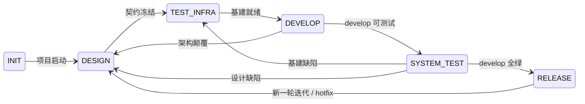

# Project Pact

## 系统全貌

项目开发遵循 6 阶段状态机，以 **Gitflow** 为分支容器。每个阶段有明确的**证明命题**和**出口把关**——Agent 通过出口把关证明该阶段的命题成立，方可推进。



### Gitflow 分支全景

```
main     ─────●──────────●──────────●────→  (tag: v1.0, v1.1, v1.2)
              ↑          ↑          ↑
release  ──── v1.0 ───── v1.1 ───── v1.2
              ↑          ↑          ↑
develop  ────●──●──●──●──●──●──●──●──●──→  (持续集成)
              ↑  ↑  ↑  ↑  ↑  ↑
             ci/ test/ feat/ feat/ fix/
             
hotfix   ──────────────────────●────────→  (main → hotfix → main + develop)
```

`main` 只有 release 节点，`develop` 有完整 TDD 证据链。`spike/*` 保留不合并。

### 阶段 → 分支 → 把关映射

| 阶段 | 在哪个分支 | 把关锚点（Git 事件） | Agent 验证 |
|------|-----------|---------------------|-----------|
| INIT | 创建 `main` + `develop` | — | 目录结构、文件存在、Git 初始化 |
| DESIGN | `spike/*`（不合并） | — | 文档内容级审查（语义、完整性、一致性） |
| TEST_INFRA | `ci/*` `test/*` `build/*` → `develop` | 全部基建分支合并 | CI 可运行（自动化）+ Mock 返回正确、覆盖率准确、门禁正确拦截（Agent 自证） |
| DEVELOP | `feat/*` `refactor/*` `perf/*` → `develop` | 全部 feature 分支合并 | MR 门禁/提测门禁（自动化）+ Report 验收结果合理性（Agent 判断） |
| SYSTEM_TEST | 在 `develop` 上执行全量测试 | develop 全量测试完成 | 测试通过（自动化）+ 失败原因分类、系统测试语义验证、阻塞级缺陷判定（Agent 判断） |
| RELEASE | `release/*` → staging → `main` + `develop` | release 合并到 main | CD 部署/冒烟（自动化）+ 发布策略、监控判定、回滚决策（Agent 判断） |
| Hotfix | `hotfix/*` → `main` + `develop` | hotfix 合并到 main | 同 RELEASE |

### 阶段证明链

| 阶段 | 证明命题 | 出口把关 |
|------|---------|---------|
| **INIT** | 项目骨架就绪，可进入设计 | 目录结构存在、AGENTS.md/CONTRIBUTING.md/CHANGELOG.md 存在、Git 已初始化、`main` + `develop` 分支已创建 |
| **DESIGN** | 契约已冻结，可进入基建搭建 | vision.md/Spec/AC 文档/接口定义 status=proposed（内容级检查）、核心 ADR 全部 status=proposed（验证段不为空）。Leader 审查通过后 promote proposed→active/accepted |
| **TEST_INFRA** | 一次性基建就绪，可进入业务开发 | 全部基建分支已合并到 `develop`、CI 可运行（自动化）、MR 门禁正确拦截（Agent 自证）、Mock 返回正确（Agent 自证）、覆盖率数据准确（Agent 自证）、系统测试框架可跑冒烟 `[适用]` |
| **DEVELOP** | 各模块独立功能正确，可进入系统测试 | 全部 feature 分支已合并到 `develop`、MR 门禁 + 提测门禁通过（自动化）、Report 中 AC 验收结果经 Agent 确认合理 |
| **SYSTEM_TEST** | 系统级验证通过，可进入发布 | `develop` 上全部测试层通过（自动化）、Agent 完成失败原因分类（基建缺陷/设计缺陷/局部 bug）、无阻塞级缺陷（Agent 判定） |
| **RELEASE** | 本轮迭代已闭环，可开始新迭代 | `release/*` 已合并到 `main` + `develop`、staging 冒烟通过（自动化）、production 冒烟通过（自动化）、Agent 确认发布策略执行和监控正常、版本 tag 已打、CHANGELOG 已整理 |

**出口把关是不可跳过的硬性检查。** Agent 在每个阶段结束时必须逐项验证出口把关，全部通过方可推进。Gitflow 提供容器的正确性（分支在哪里、合并到哪里、谁从谁拉），Agent 提供内容的正确性（文档语义、Mock 准确性、系统测试断言合理性、失败原因分类、发布决策）。

**Agent 无状态。** 任何 Agent 可以随时被终止，下次启动时仅凭文件系统恢复状态。所有关键信息在文档中，不在对话历史中。中断恢复时通过 `git log --oneline --grep="docs(state):\|docs(plan):"` 重建上下文。

---

## 迭代模式

同一状态机骨架，三种迭代模式。Agent 进入 DESIGN 时根据已有文档状态自动判断：

### 首次设计（INIT → DESIGN）

所有文档全新创建。走完所有子阶段，不加跳过。

### 增量迭代（RELEASE → DESIGN）

已有文档已冻结。进入 DESIGN 后：
- vision.md 已 active → 跳过，不重写
- Spec 已 active → 在现有文档上追加，不重写
- AC 文档已 active → 在现有文档上追加场景，不重写
- 已有 ADR 已 accepted → 不修改，仅新增 ADR
- 已有 Plan 已 done → 新建 Plan，不重建

### 设计变更（DEVELOP → DESIGN，架构颠覆退回）

从 DEVELOP 因架构颠覆退回。进入 DESIGN 后走「设计变更」子阶段：
1. 定级：确认为架构颠覆（非轻微约束）
2. ADR 修订：旧 ADR 追加修订记录，或标记 superseded + 新建 ADR
3. 传导下游：同步更新受影响的 Spec、AC 文档、通知受影响 Plan、更新 Plan
4. 恢复编码：以新 ADR 为依据重新推进到 DEVELOP

**注意：** 轻微约束（依赖能用但方式与预期不一致）在 DEVELOP 内解决，不退回 DESIGN。

### 基建修复（SYSTEM_TEST → TEST_INFRA，基建缺陷退回）

从 SYSTEM_TEST 因基建缺陷退回。进入 TEST_INFRA 后走增量修复：
1. 定级：确认为基建缺陷（门禁未拦截、覆盖率错乱、Mock 不对、系统测试框架不稳定），非业务 bug 或设计缺陷
2. 定位：定位到具体基建组件，修复对应的 Plan 或配置
3. 自证：修复后重新走 TEST_INFRA 出口把关（特别是"正确拦截"项）
4. 恢复流程：TEST_INFRA 出口把关通过后重新推进到 DEVELOP，已完成的业务 Plan 不受影响

### 设计缺陷（SYSTEM_TEST → DESIGN）

---

### 热修复（RELEASE → DESIGN，生产阻断性故障）

生产阻断性故障走热修复快速通道，从 `main` 拉 `hotfix/*` 分支：

1. 定级：确认为阻断性故障（线上不可用/核心功能损坏），非轻微缺陷
2. 轻量 DESIGN：跳过 full Spec/AC，仅修订受影响 ADR（如有设计变更）
3. TEST_INFRA：增量修复，已完成基建不受影响
4. DEVELOP：创建最小修复 Plan，走 TDD → MR 门禁
5. SYSTEM_TEST：全量回归测试
6. 合并 `hotfix/*` 到 `main` + `develop`
7. RELEASE：在 `main` 上打补丁 tag（如 v1.2.1），归档

**注意：** 非阻断性缺陷走正常增量迭代（RELEASE → DESIGN），不走热修复。

---

## 执行容器

`docs/plans/` 下的每个文件夹是一个执行容器，对应一个 Git 分支。任何需要执行的任务（搭建基建、业务开发、部署）都通过创建执行容器来组织。一个执行容器内可包含多个最小执行单元（Plan + Report 成对）。

- 文件夹内包含 README.md（子任务状态表）、Plan 文件（描述执行计划）和 Report 文件（执行结果留档）
- 一个执行容器 = 一个 Git 分支，从适当的基础分支拉出，完成后合并或保留（`spike/*` 不合并）
- 分支类型与 commit type 一致（`feat/` `fix/` `ci/` `test/` `refactor/` `perf/` `build/` `chore/` `docs/`），系统特有类型 `spike/`（ADR 验证，保留不合并）
- 分支命名格式：`<type>/<编号>-<描述>`，编号与执行容器一致。示例：`feat/0001-order-api`、`ci/0001-pipeline`
- 多个执行容器并行执行时，必须使用 `git worktree`，保证隔离且共享同一个 repo
- 各阶段创建自己的执行容器，不替下游阶段创建

---

## 安装系统

INIT 阶段将项目接入 devloop 系统。分新项目（安装）和旧项目（接入）两种场景，详见 [references/phase-init.md](references/phase-init.md)。

---

## 导航系统

系统文档是自描述的。按以下顺序读取：

```
1. AGENTS.md           → 项目入口地图：文档类型、目录结构、系统边界、阶段行为
2. docs/README.md      → 当前系统状态 + 行为边界（首先读取！）
3. CONTRIBUTING.md     → 编码/测试/PR 规范（项目自定义）
4. 各级 README.md      → 子目录索引和状态
5. 具体文档             → Vision / AC / Spec / ADR / Plan / Report
```

---

## 系统规则

### 文档命名

| 文档 | 格式 | 示例 |
|------|------|------|
| Vision | `vision.md` | `vision.md` |
| Spec | `000x-xxxx.md` | `0001-vagent.md` |
| Interface | `000x-xxxx.md` | `0001-order-api.md` |
| AC | `000x-xxxx.md` | `0001-order-ac.md` |
| ADR | `000x-xxxx.md` | `0001-db-choice.md` |
| 执行容器 | `000x-简短描述` | `0001-订单模块` |
| Plan 文件 | `0x-plan-xxx.md` | `01-plan-order-api.md` |
| Report | `0x-report-xxx.md` | `01-report-order-api.md` |

### Frontmatter

以下文档类型使用 YAML frontmatter（`---` 包裹），位于文件最顶部：

| 文档类型 | 必填字段 |
|----------|----------|
| Vision | `title`, `description`, `type: vision`, `status`, `created` |
| Spec | `title`, `description`, `type: spec`, `status`, `version`, `created` |
| Interface | `title`, `description`, `type: interface`, `status`, `created` |
| AC | `title`, `description`, `type: ac`, `status`, `created` |
| ADR | `title`, `description`, `type: adr`, `status`, `created` |
| Plan | `title`, `description`, `type: plan`, `status`, `created` |
| Report | `title`, `description`, `type: report`, `status`, `created` |

`created` 使用 ISO 8601 格式 (`YYYY-MM-DDTHH:MM:SSZ`)。`version` 仅 Spec 使用，整数递增。

`description` 字段用于 Agent 扫描时判断文档是否相关——Agent 通过 description 快速定位目标文档，无需通读全文。

以下文件**不使用** frontmatter：
- AGENTS.md、CONTRIBUTING.md、CHANGELOG.md
- 所有 README.md

### status 有效值

| 文档类型 | 状态值 | 流转 |
|----------|--------|------|
| Vision | `draft` / `proposed` / `active` | draft→proposed→active |
| Spec | `draft` / `proposed` / `active` | draft→proposed→active（同时只有一个 active） |
| AC | `draft` / `proposed` / `active` | draft→proposed→active（同时只有一个 active） |
| Interface | `draft` / `proposed` / `active` | draft→proposed→active（同时只有一个 active） |
| ADR | `draft` / `proposed` / `accepted` / `superseded` / `deprecated` | draft→proposed→accepted→superseded/deprecated |
| Plan | `pending` / `done` | pending→done。执行失败也标记 done，另写新 Plan 继续 |
| Report | `draft` / `complete` | draft→complete |

**冻结定义：** 设计师完成编写后将 status 从 `draft` 改为 `proposed`（表示"我写完了，待审查"）。Leader 审查通过后，将 `proposed` 改为 `active`（或 ADR 的 `accepted`），表示系统正式采纳。冻结后不可原地修改——要改必须退回 DESIGN，修改后重新 promote 为 active。typo 修复、措辞澄清等非破坏性修改除外。Git 记录变更历史。

### 语义链

关联通过文档正文中的文本引用和命名约定表达，不依赖 frontmatter 的 related 字段。示例：

```
AC 文档 AC-0003-N-1（正常场景）
  → Plan 01-plan-order-api.md 步骤 2: "实现 AC-0003 订单创建，覆盖所有场景"
    → Commit: "feat(order): 实现 AC-0003 订单创建"
      → Report 01-report-order-api.md: "AC-0003-N-1 [PASS], AC-0003-B-1 [PASS], AC-0003-E-1 [PASS], AC-0003-F-1 [PASS], commit abc123"
```

### Git 规则

- 文档变更和代码变更永远分开 commit
- 阶段推进伴随独立 commit，约定前缀 `docs(state):`
- 分支模型遵循 Gitflow：`main` 仅含 release 节点，`develop` 为持续集成分支
- 分支类型与 commit type 一致，从适当的基础分支拉出（`feat/*` `fix/*` `ci/*` 等从 `develop`；`hotfix/*` 从 `main`；`release/*` 从 `develop`），完成后合并
- `spike/*` 例外——ADR 验证分支，保留不合并
- `release/*` 和 `hotfix/*` 同时合并到 `main` 和 `develop`
- 具体 commit 格式和 merge 策略见 CONTRIBUTING.md

### 模板注释约定

模板文件（`assets/templates/` 下）中混有两种内容：模板骨架（实例化时保留）和说明性内容（实例化时移除）。通过注释类型区分：

| 注释类型 | 语法 | 用途 | 实例化时 |
|----------|------|------|---------|
| Markdown 注释 | `<!-- -->` | 包裹说明性内容（节标注、填写指引、边界说明） | 移除 |
| YAML 注释 | `#` | 仅 frontmatter 内，解释 status 字段的有效值和流转规则 | 保留或移除 |

未被注释包裹的内容（标题、表格结构、frontmatter 键名）是模板骨架，实例化时保留。

### 模板生命周期

项目中的模板文件（`0001-template.md`）是临时参考，不是永久文档。规则：

- 创建该类型第一个正式文档后，删除对应的模板文件
- 删除动作是正式文档创建后的原子清理，不单独执行
- 示例：DESIGN 阶段创建第一个 Spec `0001-order.md` 后，删除 `0001-template.md`

### 文档编写原则

- 不重复上层文档：Vision 已定义的内容不重述，引用即可
- 接口定义优先使用可生成代码的契约格式（如 OpenAPI、TypeScript 接口声明）
- 模块提供的能力 = 可验证的功能列表（不是"负责用户功能"，而是"提供用户注册、登录、信息查询接口"）

---

## 按阶段选择路径

确认当前阶段后，按阶段选择操作流程：

| 当前阶段 | 去读 |
|----------|------|
| INIT | [references/phase-init.md](references/phase-init.md) |
| DESIGN | [references/phase-design.md](references/phase-design.md) |
| TEST_INFRA | [references/phase-test-infra.md](references/phase-test-infra.md) |
| DEVELOP | [references/phase-develop.md](references/phase-develop.md) |
| SYSTEM_TEST | [references/phase-system-test.md](references/phase-system-test.md) |
| RELEASE | [references/phase-release.md](references/phase-release.md) |
