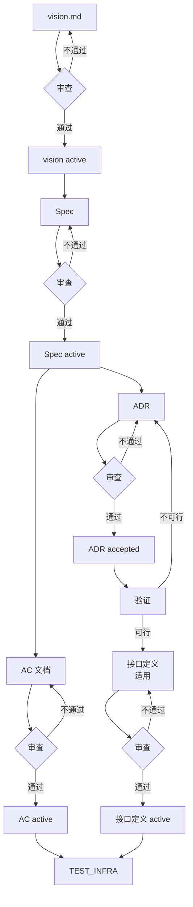

# DESIGN 阶段

## 流程

DESIGN 是需求分析、技术选型、验收标准定义的阶段。禁止编写业务代码。

**按因果链顺序推进，每个文档写完即审，审过才进下游。** 禁止全部写完后一次性审查。审查者不可由文档编写者担任。

## 子阶段

### vision.md（必选，所有项目）

**产出：** vision.md

编写业务目标、用户范围、长期理想形态。一次性定稿，不可退回。参考 `docs/vision.md` 模板。

**审查：**

| 审查内容 | 审查方法 |
|---------|---------|
| status=proposed | 读 frontmatter |
| 业务目标：非空 | 读「业务目标」段，确认有实质内容 |
| 用户范围：非空 | 读「用户范围」段，确认有实质内容 |

**审查通过后：** promote `proposed → active`，独立 commit，约定前缀 `docs(state):`。进入 Spec。

### Spec（必选，所有项目）

**产出：** Spec

编写用户故事、模块划分、数据模型、业务规则、UI 约束。参考 `docs/spec/0001-template.md`。模块划分表需包含「提供的能力」和「目录路径」列（模块→源码目录的映射）。

**审查：**

| 审查内容 | 审查方法 |
|---------|---------|
| status=proposed | 读 frontmatter |
| 用户故事 ≥ 1 条，每条含编号、角色、需求、目的、优先级 | 读用户故事表，逐行检查列完整性 |
| 模块划分 ≥ 1 个，每个含提供的能力 + 目录路径；单模块需说明原因 | 读模块划分表，检查无空列 |
| [适用] 有 API → 接口定义：入参/出参/错误码完整 | 逐接口检查三要素 |
| [适用] 有持久化 → 数据模型非空 | 读数据模型段，确认有实体定义 |
| [适用] 前端项目 → UI 约束非空 | 读 UI 约束段，确认有页面结构或组件规范 |
| 非功能指标非空 | 读非功能指标段，确认有实质内容或"无特殊要求" |

**审查通过后：** promote `proposed → active`。进入 AC 文档 + ADR（可并行）。

### AC 文档（必选，所有项目）

**产出：** AC 文档

每条 AC 必须覆盖四个场景维度（正常/边界/异常/失败）。只写正常流程的 AC 属于无效 AC。参考 `docs/ac/0001-template.md`。

**审查：**

| 审查内容 | 审查方法 |
|---------|---------|
| status=proposed | 读 frontmatter |
| AC ≥ 1 条，每条覆盖四场景（正常/边界/异常/失败） | 逐条 AC 检查场景编号：N/B/E/F 各至少 1 个 |
| 无只含正常场景的 AC | 检查每条 AC 的 B/E/F 场景是否非空 |
| 预期结果可观测、可验证，无模糊词汇 | 抽查预期结果列，搜索"合理""流畅""适当""正常"等模糊词 |

**审查通过后：** promote `proposed → active`。

### ADR（必选，所有项目）

**产出：** ADR

每个技术决策一个文件。ADR 定的是规则、约束、底层选型（通信协议、数据序列化、统一错误码规范、存储选型、架构模式）。不定义某个业务接口的入参、字段。（接口字段来自 Spec。）参考 `docs/adr/0001-template.md`。

**核心 ADR 判定：** 技术栈 ADR 必选。有持久化→存储 ADR。多模块/多服务→架构模式 ADR。

**审查：**

| 审查内容 | 审查方法 |
|---------|---------|
| 技术栈 ADR status=proposed | 读 frontmatter |
| [适用] 有持久化 → 存储 ADR status=proposed | 读 frontmatter |
| [适用] 多模块/多服务 → 架构模式 ADR status=proposed | 读 frontmatter |

**审查通过后：** promote `proposed → accepted`。进入验证。

**提示：** ADR 修订历史无需手动维护表格。`git log -p -- docs/adr/0001-xxx.md` 即为完整修订记录。

### 验证（必选，所有项目）

**产出：** ADR 验证段填写完成

基于 ADR 编写最小验证代码，验证技术方案可行性。验证通过后方可推进到接口定义。

**验证范围：**
- 技术选型类 ADR：必须验证（使用了不熟悉的库/框架/协议/依赖）
- 多 ADR 组合：验证协同工作（如"框架 + ORM + 缓存 三者能否一起跑通"）
- 约定/标准类 ADR：不需要验证（编码规范、版本策略、命名约定）

**验证方式：** 从 `develop` 拉出 `spike/<描述>` 分支，编写最小验证代码。验证通过后保留分支（不合并），ADR 的「验证」段记录复现步骤和分支名，供后续阶段参考。

**审查：**

| 审查内容 | 审查方法 |
|---------|---------|
| 所有需验证的 ADR 验证段非空 | 逐 ADR 读「验证」段，确认有验证记录 |
| 所有验证结论为「可行」 | 逐 ADR 读「验证」段结论列，确认无「不可行」 |
| 约定/标准类 ADR 可跳过验证 | 检查 ADR 类型，确认不涉及技术选型 |

**审查通过后：** 进入接口定义（如有）。验证 branch 记录在 ADR 中，不合并。

### 接口定义（适用：有 API 的项目）

**产出：** 接口定义文档（独立于 Spec，参考 `docs/interface/0001-template.md`）

接口的业务字段来自 Spec 的用户故事、模块划分、数据实体。AC 的异常/失败场景决定错误码。ADR 决定的是传输格式，接口定义决定的是传输内容（字段名、类型、含义）。

**审查：**

| 审查内容 | 审查方法 |
|---------|---------|
| status=proposed | 读 frontmatter |
| 所有接口有明确的入参/出参/错误码 | 逐接口检查三要素 |

**审查通过后：** promote `proposed → active`。

---

全部文档审查通过后：更新 `docs/README.md` 当前阶段为 TEST_INFRA，提交。约定前缀 `docs(state):`。

## 增量迭代

已有文档已冻结，仅审查**新增/修改**的文档：

| 审查内容 | 审查方法 |
|---------|---------|
| 新增 Spec 满足上述内容级检查 | 按首次设计 Spec 表逐项检查 |
| 修改 Spec 的节保持原有完整性 | 对比修改前后，确认无意外删除 |
| 新增 AC 文档满足四场景维度检查 | 按首次设计 AC 表逐项检查 |
| 新增 ADR status=proposed（技术选型类验证段不为空） | 读 frontmatter + 验证段 |
| 新增 Plan 含 Constraints/Checkpoint | 逐 Plan 检查 |
| 已有 ADR 未被原地修改 | 检查已有 ADR 的修订记录，确认无直接篡改原始决策 |

## 设计变更

从 DEVELOP 退回时，仅审查**变更影响范围**：

| 审查内容 | 审查方法 |
|---------|---------|
| ADR 修订完成（旧 ADR 追加修订记录或标记 superseded + 新建 ADR） | 读旧 ADR 修订记录，确认非空；或读新 ADR status=proposed |
| Spec 同步更新（受影响章节） | 对比 ADR 变更内容，检查 Spec 对应章节是否同步 |
| AC 文档同步更新（受影响场景） | 对比 ADR 变更内容，检查 AC 对应场景是否同步 |
| Plan 已调整（受影响 Plan） | 读受影响 Plan，确认已更新 |
| 新增技术选型类 ADR 的验证段不为空 | 读「验证」段 |
| 新增 ADR status=proposed | 读 frontmatter |

## 回退规则

- 发现架构不可行 → 重新设计，不推进
- 在其他阶段发现设计缺陷 → 更新 `docs/README.md` 当前阶段为 DESIGN，提交
- vision.md 不可退回

## 参考实现

以下为示例，按项目类型裁剪。

### 全栈 Web 项目（示例）

涉及文档：vision.md → Spec → AC 文档 → ADR → 验证 → 接口定义

TEST_INFRA 节点：CI 流水线 + 部署底座 + 测试框架 + Mock 服务 + 契约测试框架 + 系统测试框架 + 覆盖率配置 + 测试数据工厂 + MR 门禁 + 提测门禁

### CLI 工具项目（示例）

涉及文档：vision.md → Spec → AC 文档 → ADR → 验证

TEST_INFRA 节点：CI 流水线 + 部署底座 + 测试框架 + 覆盖率配置 + 测试数据工厂 + MR 门禁 + 提测门禁

### 前端组件库项目（示例）

涉及文档：vision.md → Spec → AC 文档 → ADR → 验证

TEST_INFRA 节点：CI 流水线 + 部署底座 + 测试框架 + 组件测试框架 + 视觉回归框架 + 覆盖率配置 + MR 门禁 + 提测门禁