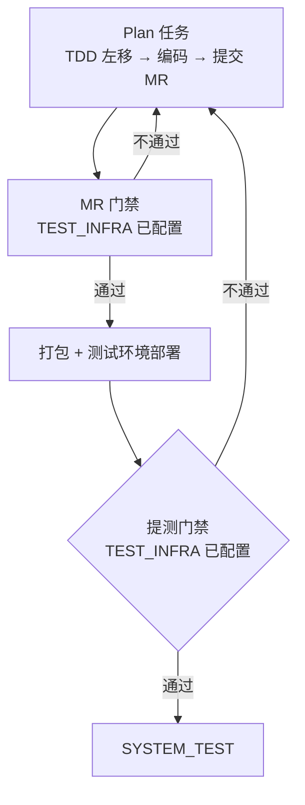

# DEVELOP 阶段

## 流程

DEVELOP 是基于 TEST_INFRA 阶段搭建的一次性基建，执行业务开发的阶段。MR 门禁、提测门禁已在 TEST_INFRA 配置完成，本阶段直接使用。



## 子阶段

### 创建 Plan

在 `docs/plans/` 下创建执行单元。

**从 Spec 创建 Plan：** Spec 的模块划分表每行对应一个 Plan 文件夹。Plan 的粒度由项目自行决定，devloop 不预设。

示例：
```
Spec 模块划分表              →  Plan 文件夹
├── 用户服务 (src/user/)     →  docs/plans/0001-用户服务/
├── 订单服务 (src/order/)    →  docs/plans/0002-订单服务/
└── 前端 (src/web/)          →  docs/plans/0003-前端/
```

每个 Plan 文件夹内含 README.md（子任务状态表）。子任务按 AC 场景和接口定义拆分，粒度由项目自行决定。

**架构级依赖：** Agent 从模块划分表判断 Plan 间的依赖关系，决定执行顺序。代码级依赖（A 函数调 B 函数）Agent 内部处理，不体现在 Plan 级。常见模式示例：

| 架构关系 | Plan 依赖 | 执行顺序 |
|---------|----------|---------|
| 独立服务 | 无依赖 | 并行 |
| 前后端分离（接口已定义） | 无依赖 | 并行（Mock） |
| 共享库/基础包 | 基础包先做 | 共享层 → 消费方 |
| 单体应用 | 无 Plan 间依赖 | 一个 Plan 文件夹，Agent 内部排序 |

依赖关系记录在 Plan 文件夹的 README.md 中。示例：

```markdown
| 子任务 | 依赖 | 状态 |
|--------|------|------|
| 01-plan-user-api.md | — | pending |
| 02-plan-order-api.md | 01 | pending |
```

### 编码

每个 Plan 在独立 Git branch 中执行。流程：TDD 左移 → 提交 MR → MR 门禁自动运行（TEST_INFRA 阶段已配置）。

**TDD 左移：** 基于 AC 四场景（正常/边界/异常/失败），先写测试，再写代码，跑通。必须编写：

| 层 | 覆盖范围 | 要求 |
|----|---------|------|
| 单元测试 | 函数/方法/类内部逻辑 | 正常分支 + 边界值 + 异常抛出 + 错误返回 |
| 开发集成自测 `[适用]` | 模块内部协作 | 用 Mock 屏蔽外部依赖 |
| 契约测试 `[适用]` | 前后端/服务间接口契约 | 提前发现参数/返回结构不一致 |

**单元测试维度：**

| 维度 | 示例 |
|------|------|
| 正常分支 | 正确输入 → 预期输出 |
| 边界值 | 空值、最大长度、零值、负值、边界日期 |
| 异常抛出 | 非法参数 → 抛出指定异常 |
| 错误返回 | 无效状态 → 返回错误码 |

**开发集成自测维度 `[适用]`：**

| 维度 | 示例 |
|------|------|
| 入参校验 | 必填参数缺失 → 错误 |
| 参数边界 | 参数超长、数值越界 → 错误 |
| 异常入参 | 非法格式、注入攻击 → 错误 |
| Mock 失败 | 外部依赖超时 → 降级处理 |

门禁不通过 → 修复 → 重新提交。全部通过后方可合并。

**Plan 分步计划：**

```
1. 读 AC 文档，确认本次覆盖的 AC 场景
2. 编写单元测试（基于 AC 四场景，先写测试）
3. 编写代码让测试通过
4. [适用] 编写开发集成自测
5. [适用] 编写契约测试
6. 运行全部测试层（具体命令见 CONTRIBUTING.md）
7. 不通过 → 修复 → 重新运行，直到全部通过
8. 通过 → 提交代码
9. 在 Report 中记录测试结果（各层通过/失败数 + 覆盖率）
```

**执行边界：**

- 你必须做：实现 Spec 定义的接口和逻辑、TDD 左移、编写部署配置、逐条 AC 场景标注 [PASS]/[FAIL]
- 你必须不做：不修改 Spec/ADR/AC 文档、不新增未在 AC 中定义的功能、不修改 docs/README.md 的系统状态字段

**Report 输出格式（示例）：**

```markdown
## 测试摘要
| 测试层 | 通过/总数 | 失败用例 | 覆盖率 |
|--------|----------|----------|--------|
| 单元测试 | 42/42 | — | 87% |
| 开发集成自测 | 15/15 | — | — |
| 契约测试 | 8/8 | — | — |

## 验收结果
| AC 场景 | 状态 | 说明 |
|---------|------|------|
| AC-001-N-1 | [PASS] | 正常创建订单，commit abc123 |
| AC-001-B-1 | [PASS] | 空用户名返回 400 |
| AC-001-E-1 | [PASS] | 非法 token 返回 401 |
| AC-001-F-1 | [PASS] | DB 超时返回 503 |
```

**辅助手段（不能当主力）：**
- 错误推测：依靠过往经验预判易出问题点 → 补充到 AC 中
- 缺陷沉淀：线上/测试发现 bug 后 → 补充缺失的 AC 场景 → 补齐用例

### 打包部署

所有 Plan 完成、MR 门禁全部通过后，执行打包部署。部署底座由 TEST_INFRA 阶段搭建，各服务的部署配置（构建命令、环境配置、部署描述）作为 Plan 的执行产出之一。部署到测试环境后冒烟测试通过即完成。

### 提测门禁

提测门禁在 TEST_INFRA 阶段已配置，此处仅执行。验证内容：

| 审查内容 | 审查方法 |
|---------|---------|
| 所有 Plan Report 测试报告完整 | 逐 Report 检查各层通过/失败数 + 覆盖率 |
| 所有 AC 四场景标注 [PASS] | 逐 Report 检查验收结果 |
| 测试环境部署成功 | 冒烟测试通过 |
| 覆盖率达标 | 对照覆盖率目标值 |

门禁不通过 → 退回对应 Plan 修复，重新走 MR 门禁 → 打包部署 → 提测门禁。

## 推进到 SYSTEM_TEST

提测门禁通过后：更新 `docs/README.md` 当前阶段为 SYSTEM_TEST，追加最近事件，提交。约定前缀 `docs(state):`。

## 异常处理

| 异常 | 处理 |
|------|------|
| 执行者崩溃 | 丢弃 branch/worktree，任务重置为 pending |
| 步骤失败 | branch 内回退至步骤快照，内部重试 |
| MR 门禁不通过 | 修复代码，重新提交 |
| 提测门禁不通过 | 退回对应 Plan，修复后重新走流程 |
| 架构不可行 — 轻微约束 | 依赖能用但方式与预期不一致。更新 ADR 追加修订记录，在 DEVELOP 内调整 |
| 架构不可行 — 架构颠覆 | 技术路线走不通。停止 DEVELOP，退回 DESIGN（见 phase-design.md「设计变更」） |
