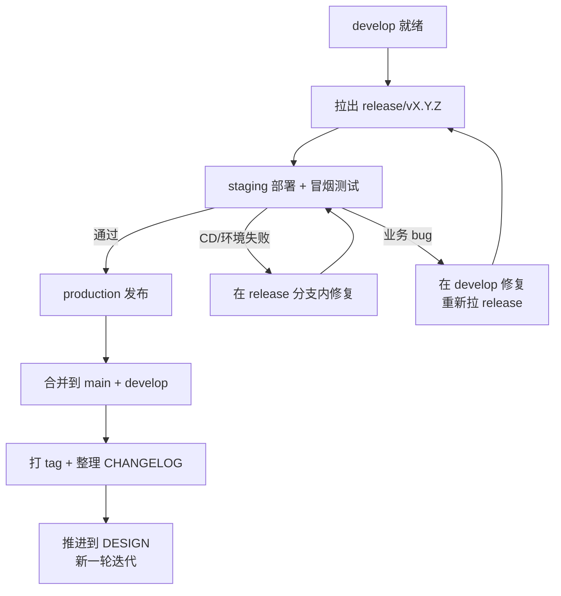

# RELEASE 阶段

## 流程

RELEASE 是迭代闭环阶段。从 `develop` 拉出 `release/vX.Y.Z` 分支，staging 验证 → production 发布 → 合并到 `main` + `develop`。



## 子阶段

### staging 验证（必选，所有项目）

```
1. 执行 CD 脚本，部署到 staging 环境
2. 执行冒烟测试（核心流程快速验证）
3. 环境配置验证
4. 确认版本号、tag、回滚方案
```

staging 冒烟失败，分两类处理：

| 失败类型 | 处理 |
|---------|------|
| CD 脚本/环境配置 | 在 `release/*` 分支内修复，重新部署 |
| 业务功能 bug | 在 `develop` 修复后，重新拉 `release/*` 分支 |

### production 发布（必选，所有项目）

staging 冒烟通过后，进入 production 发布前，需上级审查确认发布决策。

```
1. 确认发布策略（一次性发布 / 灰度放量 / 蓝绿部署，按项目实际选择）
2. 执行 CD 脚本，部署到 production 环境
3. 执行生产冒烟测试（核心流程快速验证）
4. 发布期间监控核心指标 → 指标恶化或冒烟失败 → 执行回滚方案
5. 合并 `release/*` 到 `main` + `develop`
6. 在 `main` 上打版本 tag: git tag vX.Y.Z
7. 整理 CHANGELOG.md: 将 [Unreleased] 段整理为正式版本条目。可用 `git log --oneline v1.0..v1.1` 查看版本间变更列表，Agent 据此分类和润色。
8. 迭代复盘: 记录工期偏差、问题总结、改进点
9. 归档本轮迭代文档
10. 删除 `release/*` 分支
```

## 推进到 DESIGN

更新 `docs/README.md` 当前阶段为 DESIGN，提交。约定前缀 `docs(state):`。

## 回退规则

- staging 冒烟失败（CD/环境）→ 在 `release/*` 内修复后重新部署
- staging 冒烟失败（业务 bug）→ 在 `develop` 修复后重新拉 `release/*`
- production 冒烟失败或指标恶化 → 执行回滚方案，分析后决定热修复或下一轮迭代
- production 阻断性故障 → 从 `main` 拉 `hotfix/*`，合并到 `main` + `develop`
