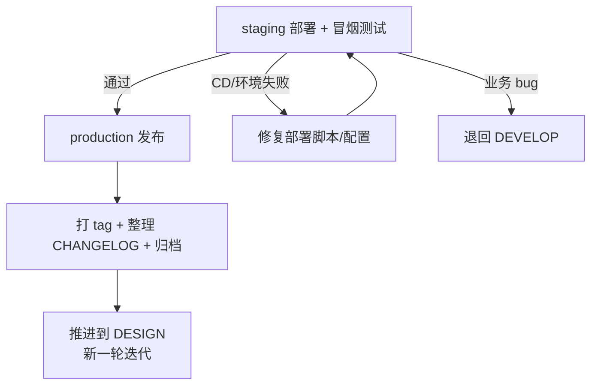

# RELEASE 阶段

## 流程

RELEASE 是迭代闭环阶段。分两步：staging 验证 → production 发布。



## 子阶段

### staging 验证（必选，所有项目）

```
1. 执行 CD 脚本，部署到 staging 环境
2. 执行冒烟测试（核心流程快速验证）
3. 环境配置验证
4. 确认版本号、tag、回滚方案
```

staging 冒烟失败，分两类处理：

| 失败类型 | 处理 |
|---------|------|
| CD 脚本/环境配置 | 在 RELEASE 内修复，重新部署 |
| 业务功能 bug | 退回 DEVELOP，修复后重新走 MR 门禁 → 打包 → 提测 → SYSTEM_TEST → RELEASE |

### production 发布（必选，所有项目）

```
1. 确认发布策略（一次性发布 / 灰度放量 / 蓝绿部署，按项目实际选择）
2. 执行 CD 脚本，部署到 production 环境
3. 执行生产冒烟测试（核心流程快速验证）
4. 发布期间监控核心指标 → 指标恶化或冒烟失败 → 执行回滚方案
5. 打版本 tag: git tag vX.Y.Z
6. 整理 CHANGELOG.md: 将 [Unreleased] 段整理为正式版本条目
7. 迭代复盘: 记录工期偏差、问题总结、改进点
8. 归档本轮迭代文档
```

## 推进到 DESIGN

更新 `docs/README.md` 当前阶段为 DESIGN，追加最近事件，提交。约定前缀 `docs(state):`。

## 回退规则

- staging 冒烟失败（CD/环境）→ 修复后重新部署
- staging 冒烟失败（业务 bug）→ 退回 DEVELOP，重新走完整流程
- production 冒烟失败或指标恶化 → 执行回滚方案，分析后决定热修复或下一轮迭代
- production 阻断性故障 → 启动热修复流程（见 SKILL.md「热修复」）
