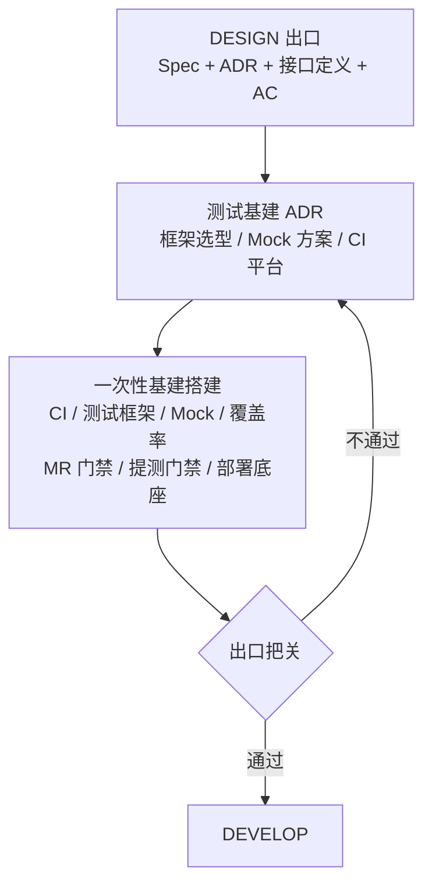

# TEST_INFRA 阶段

## 流程

TEST_INFRA 是 DESIGN 契约冻结后的第一个执行阶段。职责是设计并搭建一次性基建——CI 流水线、测试框架、Mock 服务、覆盖率采集、测试数据工厂、MR 门禁、提测门禁、部署底座——为 DEVELOP 阶段的业务开发提供可验证的环境。E2E 框架 `[适用]`、契约测试框架 `[适用]` 按项目类型决定。

进入 TEST_INFRA 后先做测试基建设计（轻量，仅 ADR），再创建 Plan 执行单元、搭建基建。

## 子阶段

### 测试基建设计

轻量设计，仅产出 ADR，不需要 vision/Spec/AC。基于 DESIGN 出口的 Spec + 接口定义 + 业务 ADR 确定测试基建的技术选型。

**需要决策的 ADR：**

| ADR | 决策内容 | 触发条件 |
|-----|---------|---------|
| 测试框架选型 | 单元测试框架 | 所有项目 |
| Mock 方案 | Mock 策略和工具 | 有外部依赖的项目 |
| E2E 框架选型 | E2E 测试框架 | 有 UI 的项目 |
| CI 平台 | CI 平台选型 | 所有项目 |
| 覆盖率工具 | 覆盖率采集工具 | 所有项目 |
| 测试数据策略 | 测试数据管理方案 | 有持久化的项目 |
| 部署策略 | 部署平台和方式 | 所有项目 |
| 专项测试工具 | 性能/安全/兼容性测试工具 | 有性能/安全要求的项目 |

ADR 与业务 ADR 放在同一目录 `docs/adr/`，按编号递增。格式同业务 ADR（含验证段）。

**退出条件：** 上述 ADR 全部 status=proposed（验证段可为空，验证在搭建完成后进行）。

### 一次性基建搭建

测试基建设计完成后，在 `docs/plans/` 下创建执行单元。

职责是**搭建武器工厂，不是制造武器**——具体测试用例由开发者在 DEVELOP 阶段各自 Plan 中编写。

#### 1. 确定测试层级

根据项目类型确定需要的测试层。以下为常见参考，项目自行组合：

| 测试层 | 适用条件 | 说明 |
|--------|---------|------|
| 单元测试 | 所有项目 | 函数/方法/类内部逻辑 |
| 集成测试 | 所有项目 | 模块间协作 |
| 契约测试 | 前后端/服务间 | 接口契约一致性 |
| E2E 测试 | 有 UI 的项目 | 端到端业务流程 |
| 视觉回归 | 前端项目 | UI 截图比对 |

#### 2. 搭建测试框架

- 安装测试框架
- 创建测试目录结构
- 配置测试脚本（每个测试层一个入口）
- 将测试命令和测试目录写入 CONTRIBUTING.md

#### 3. 搭建 E2E 脚手架 `[适用]`

有 UI 的项目需要搭建 E2E 测试环境：

- 配置 E2E 框架（浏览器驱动、截图、trace）
- 编写测试辅助工具（测试账号、测试数据、环境变量）
- 确保 E2E 框架可成功启动（即使测试用例为空）

#### 4. 配置 CI 流水线

- 配置 CI，每次提交自动运行构建和测试
- 确保 CI 环境可运行测试框架

#### 5. 配置 MR 门禁

- 配置 CI 在 MR 提交时自动运行：单元测试 + 开发集成自测。契约测试 `[适用]`
- 设置通过条件：全部测试层通过 + 覆盖率达标
- 验证 MR 门禁可触发（提交占位 MR，确认流水线启动）

#### 6. 配置提测门禁

- 配置提测检查脚本：Report 完整性、AC 验收标注、覆盖率检查
- 验证提测门禁脚本可执行

#### 7. 配置部署底座

搭建部署平台，所有服务复用。具体服务的部署配置（构建命令、环境配置、部署描述）由 DEVELOP 阶段各 Plan 自行编写。

- 配置 CI/CD 流水线框架（打包 → 部署 → 冒烟测试）
- 配置部署平台（容器注册中心、k8s namespace 等，按项目实际选择）
- 用一个占位服务验证部署链路可通（部署成功且冒烟通过）

#### 8. 自证

在接入真实业务前，验证基建能正确判断对错，而非仅能启动：

- MR 门禁：提交故意失败的测试，确认 CI 报红阻断合并
- 提测门禁：构造不达标的 Report（覆盖率不足/AC 未标注），确认门禁阻断
- Mock：对照接口定义验证返回结构（字段名、类型、错误码）
- 覆盖率：用已知代码基线跑，确认采集数据与人工统计一致
- E2E 脚本 `[适用]`：逐条对照 AC 四场景静态检查，确认覆盖完整、断言精准、入参/错误码与接口定义一致

**执行边界：**

- 你必须做：搭建测试框架、配置 CI 流水线、配置 MR 门禁和提测门禁、配置部署底座、自证基建能正确判断对错。E2E `[适用]`、契约测试 `[适用]`
- 你必须不做：不编写具体测试用例（属于 DEVELOP 阶段职责）、不编写业务代码、不修改 Spec 或 ADR、不推进系统状态

## 出口把关

| 审查内容 | 审查方法 |
|---------|---------|
| 测试基建 ADR 全部 proposed | 逐 ADR 检查 frontmatter status |
| CONTRIBUTING.md 测试段已填写 | 检查测试命令和测试目录段非空 |
| CI 流水线可运行 | 触发一次 CI，确认构建和测试脚本可执行 |
| MR 门禁正确拦截 | 提交一个故意失败的测试，确认 CI 报红阻断合并 |
| 提测门禁正确拦截 | 构造不达标的 Report（覆盖率不足/AC 未标注），确认门禁阻断 |
| 部署底座可通 | 占位服务部署成功且冒烟测试通过 |
| Mock 返回正确 | 对照接口定义验证 Mock 返回结构（字段名、类型、错误码） |
| 覆盖率数据准确 | 用已知代码基线跑，确认采集数据与人工统计一致 |
| E2E 框架可跑冒烟 `[适用]` | 运行一个占位 E2E 用例，确认框架启动成功 |
| E2E 脚本对齐 AC `[适用]` | 静态检查：逐条 AC 核对四场景是否覆盖，断言是否精准，入参/错误码是否与接口定义一致 |
| 所有 Plan 文件夹已创建 | 逐 Plan 检查 README.md 存在 |
| 一次性基建 Plan 全部 done | 检查 Plan README 状态表 |

## 推进到 DEVELOP

全部通过后：更新 `docs/README.md` 当前阶段为 DEVELOP，追加最近事件，提交。约定前缀 `docs(state):`。

## 参考实现

以下为示例，按项目类型裁剪。

### 全栈 Web 项目（示例）

CI 流水线 + 部署底座 + 测试框架 + Mock 服务 + 契约测试框架 + E2E 框架 + 覆盖率配置 + 测试数据工厂 + MR 门禁 + 提测门禁

### CLI 工具项目（示例）

CI 流水线 + 部署底座 + 测试框架 + 覆盖率配置 + 测试数据工厂 + MR 门禁 + 提测门禁

### 前端组件库项目（示例）

CI 流水线 + 部署底座 + 测试框架 + 组件测试框架 + 视觉回归框架 + 覆盖率配置 + MR 门禁 + 提测门禁
