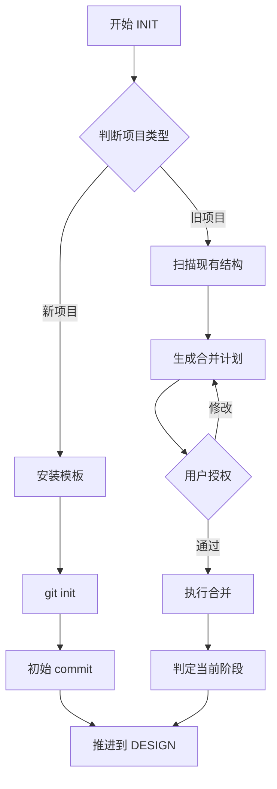

# INIT 阶段

## 流程

INIT 是将项目接入 devpact 系统的阶段。系统 = 文档体系（状态）+ 流程描述（skill）。接入后，状态机接管，Agent 按流程走。



## 子阶段

### 判断项目类型

首先判断是新项目还是旧项目：

- **新项目：** 空目录，或仅有 README。无代码、无 git 历史。
- **旧项目：** 已有代码仓库。有 git 历史、现有代码、可能已有文档。

### 新项目：安装

```
1. 复制 assets/templates/ 下的 AGENTS.md, CONTRIBUTING.md, CHANGELOG.md 到项目根目录
2. 复制 assets/templates/docs/ 下全部内容到项目 docs/ 目录
3. 填写 CONTRIBUTING.md 的项目信息：开发环境、代码风格、分支策略、PR 流程（测试命令和测试目录段留空，由 TEST 阶段填写）
4. git init（如尚未初始化）
5. 在 docs/README.md 中设置当前阶段为 DESIGN
6. 提交（commit message 描述变更内容，格式见 CONTRIBUTING.md）
```

### 旧项目：接入

旧项目接入遵循两个原则：

1. **合并/转换优先，隔离安装兜底。** 尽最大努力将现有内容融入 devpact 体系，而非另起炉灶。
2. **devpact 自完备。** 接入后，devpact 所需的全部文档类型（vision、Spec、AC、ADR、Plan）必须存在，即使部分内容为占位符。

**第一步：扫描**

扫描项目现有结构，识别以下内容：

- 根目录：AGENTS.md、CONTRIBUTING.md、CHANGELOG.md、README.md
- docs/ 或类似目录下：已有的 ADR、设计文档、API 契约、测试用例
- 代码：package.json / Cargo.toml / go.mod 等（推断技术栈）、src/ 结构（推断模块）、tests/ 结构（推断测试覆盖）

**第二步：生成合并计划**

基于扫描结果，生成合并计划表。计划中每项标注操作类型：

| 操作 | 含义 |
|------|------|
| 创建 | 新文件，从模板安装 |
| 合并 | 现有文件 + devpact 内容追加整合 |
| 转换 | 现有内容转换格式后移入 devpact 目录 |
| 保留 | 现有内容不动，在 devpact 文档中引用 |
| 跳过 | 已存在且无需变更 |

**合并计划示例：**

```
### 合并计划

| 目标文件 | 操作 | 说明 |
|---------|------|------|
| AGENTS.md | 跳过 | 已存在，在现有文件中追加 devpact 导航段 |
| CONTRIBUTING.md | 合并 | 追加 devpact 约定段（commit 格式、文档命名、frontmatter 规则） |
| CHANGELOG.md | 跳过 | 已存在 |
| docs/vision.md | 创建 | 从 README 提取 |
| docs/spec/ | 创建 | 从现有代码推断模块，占位符填充 |
| docs/ac/ | 创建 | 从现有测试推断 AC 场景，占位符填充 |
| docs/adr/0001-stack.md | 转换 | 从 package.json/tsconfig 推断技术栈 |
| 已有 docs/spec/xxx.md | 保留 | 在 Spec 中引用 |
| 已有 docs/adr/ | 转换 | 补充 frontmatter，移入 docs/adr/ |
```

**第三步：用户授权**

将合并计划呈现给用户，逐项确认。用户可对任何项选择：同意 / 修改 / 拒绝。

**第四步：执行**

按授权后的计划执行。完成后：

- 在 docs/README.md 中设置当前阶段为 DESIGN
- 提交 (遵守项目提交规范)
- 判定当前阶段，推进：

| 现有代码状态 | 判定为 |
|-------------|--------|
| 无代码/有部分代码 | DESIGN |
| 有完整代码 + 测试 | DESIGN（走增量迭代，补全文档） |
| 生产运行中，需要维护 | DESIGN（走增量迭代，hotfix 模式） |

