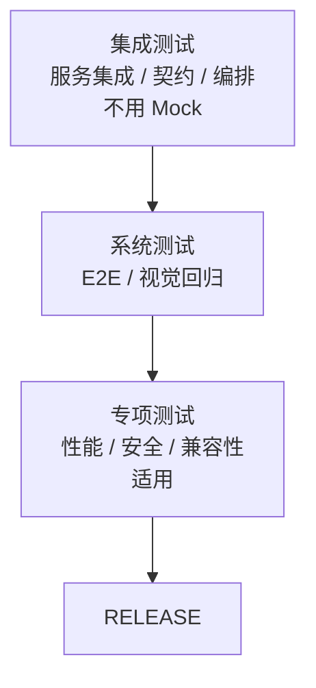

# SYSTEM_TEST 阶段

## 流程

SYSTEM_TEST 必须等所有 Plan done 才能进入。执行系统级验证——集成测试、系统测试、专项测试。单元测试和开发集成自测已在 DEVELOP 阶段完成，不在此重复。禁止新增功能代码。



## 子阶段

### 集成测试（必选，所有项目）

按层级顺序执行，不可跳过。具体命令见 CONTRIBUTING.md 或项目测试脚本配置：

```
1. 服务集成测试（跨模块/跨服务，不用 Mock）
2. 接口契约测试（如果有）
3. 接口编排测试（如果有）
```

每层通过后才进入下一层。

### 系统测试（必选，所有项目）

```
4. E2E 测试（如果有 UI）
5. 视觉回归测试（如果是前端）
```

验证完整业务链路黑盒回归，确认整体功能符合 AC 验收标准。

### 专项测试（适用：有性能/安全要求的项目）

专项测试的验收标准在 DESIGN 阶段已写入 Spec 非功能指标和 AC 文档。工具选型在 TEST 阶段 ADR 已确定。**执行脚本依赖真实部署环境，等 E2E 功能自动化验证稳定后才编写和执行。**

每项产出独立 Report。

**性能测试：**

- 负载测试：逐步加压至目标并发，记录响应时间和错误率，对照 Spec 非功能指标
- 压力测试：超过目标并发，确认系统降级而非崩溃
- 基准对比：对比上版本指标，确认无性能回退

**安全测试：**

- 依赖漏洞扫描：确认 CI 已覆盖（MR 门禁 SAST），无遗漏
- 渗透测试：OWASP Top 10 基础检查
- 敏感信息泄露：检查日志、响应头、错误页面

**兼容性测试：**

- 浏览器兼容（前端项目）
- API 版本兼容（有 API 版本管理的项目）

**执行边界：**

- 你必须做：确认所有 Plan 已 done、按层级顺序执行全量测试、失败时提取失败用例名/失败断言/截图路径、全部通过后生成测试报告
- 你必须不做：不新增功能代码、不修改 Spec 或 ADR。基建缺陷退回 TEST，设计缺陷退回 DESIGN

### 修复循环（适用：测试失败时）

修复在 SYSTEM_TEST 内部完成——不退回 DEVELOP。

每层失败时：
1. 停止，不继续下一层
2. 提取失败信息：失败用例名、失败断言、截图路径
3. 在 SYSTEM_TEST 内修复 bug（创建临时 branch，修复后合并）
4. 修复完成后，重新从失败的那层开始执行

修复规则：
- 只修 bug，不新增功能
- 修复完成后重新执行全量测试（从失败层开始）
- 如果发现基建缺陷（门禁未拦截、覆盖率数据错乱、Mock 返回不对、E2E 框架不稳定）→ 更新 `docs/README.md` 当前阶段为 TEST，提交
- 如果发现设计缺陷（不是 bug，是契约本身有问题）→ 更新 `docs/README.md` 当前阶段为 DESIGN，提交

## 推进到 RELEASE

全部测试通过后：更新 `docs/README.md` 当前阶段为 RELEASE，追加最近事件，提交。约定前缀 `docs(state):`。

## 输出格式（示例）

测试摘要（不要输出完整日志）：

```markdown
| 测试层 | 通过/总数 | 失败用例 | 耗时 |
|--------|----------|----------|------|
| 服务集成测试 | 5/5 | — | 4.1s |
| E2E | 2/3 | AC-007 (选择器超时) | 15.8s |

结论: [FAIL] 未通过 / [PASS] 全部通过
```
